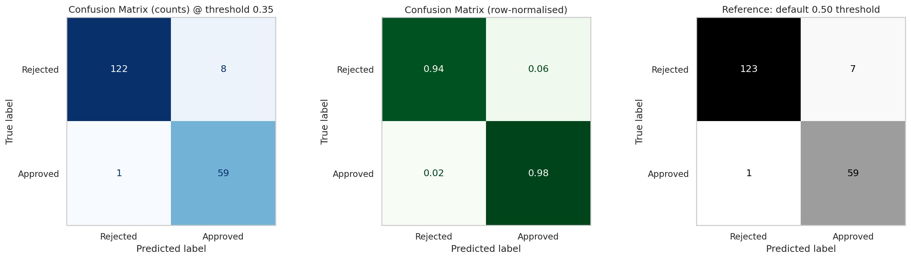
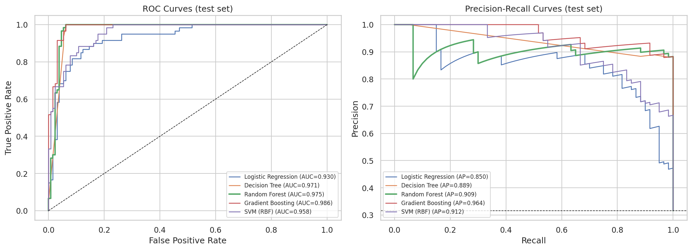
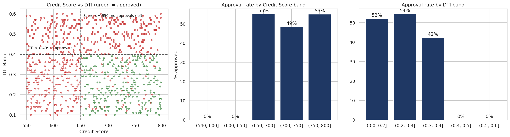
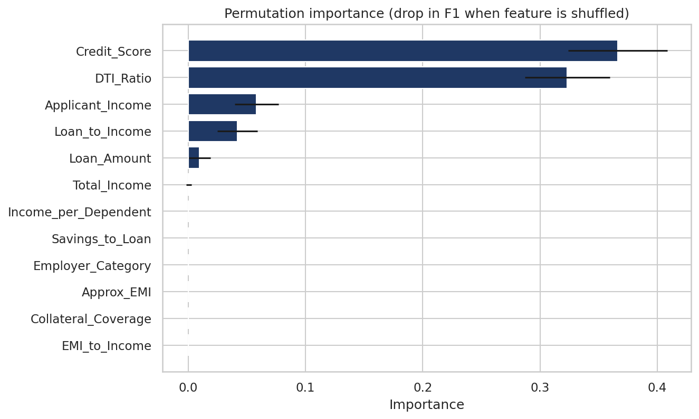
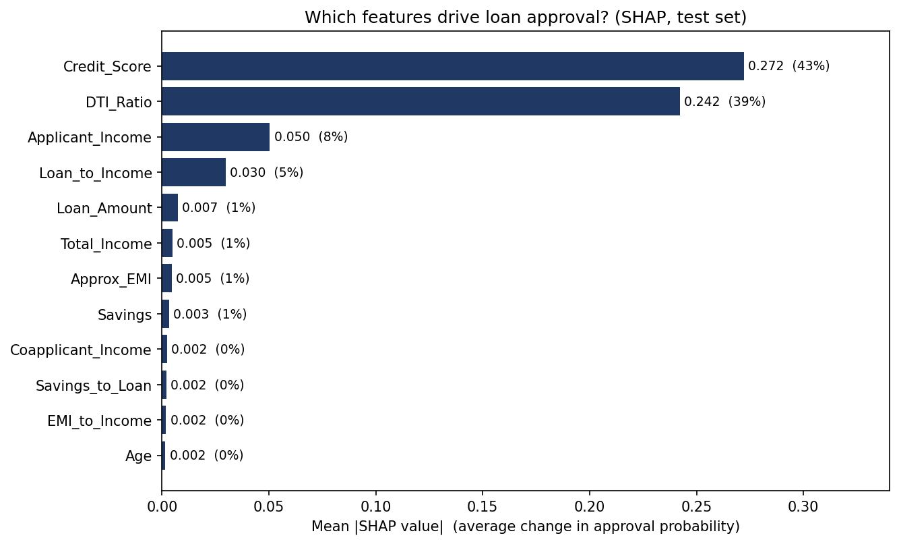
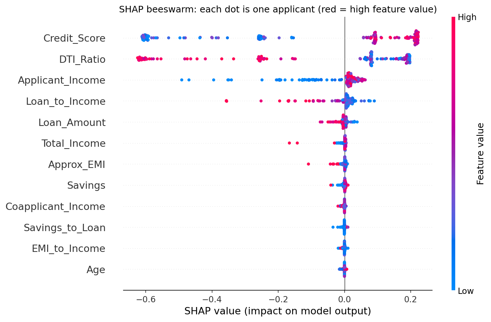
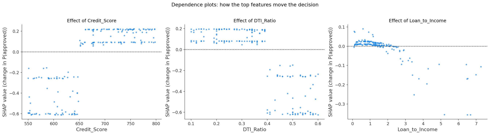
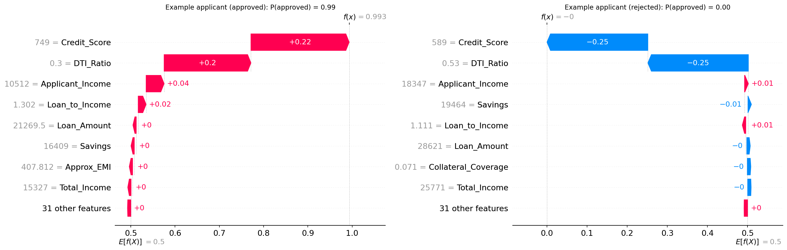

# Loan Approval Prediction System


An end-to-end machine-learning pipeline that predicts whether a loan application should be **approved or rejected**. It covers data cleaning, exploratory analysis, banking-ratio feature engineering, comparison of five tuned models, decision-threshold optimisation, evaluation (precision, recall, F1, confusion matrix, ROC/PR), explainability and a fairness audit.

> 📄 **Full report:** [`docs/Loan_Approval_Project_Report.pdf`](docs/Loan_Approval_Project_Report.pdf)

## Results at a glance

Final model: **Random Forest**, evaluated once on a hold-out test set of 190 applications (decision threshold 0.35).

| Metric | Value |
|---|---|
| Precision (approved) | 0.881 |
| Recall (approved) | 0.983 |
| F1 score | 0.929 |
| ROC-AUC | 0.975 |
| Accuracy | 95.3% |

**Confusion matrix:** 122 correct rejections · 8 wrongly approved · 1 wrongly rejected · 59 correct approvals

| Model (5-fold CV on training data) | Precision | Recall | F1 | ROC-AUC |
|---|---|---|---|---|
| **Random Forest** | 0.906 | 0.970 | **0.937** | 0.982 |
| Gradient Boosting | 0.897 | 0.975 | 0.934 | 0.980 |
| Decision Tree | 0.882 | 0.962 | 0.920 | 0.960 |
| SVM (RBF) | 0.796 | 0.823 | 0.808 | 0.939 |
| Logistic Regression | 0.733 | 0.861 | 0.792 | 0.924 |

<p align="center">
  <br>
  
</p>

## Key findings

- **Credit score and DTI ratio drive decisions.** No applicant with a credit score of 650 or below, or a DTI above 0.40, was approved. These two features dominate the model's importance.
- **A simple policy comes close.** A depth-3 decision tree (credit score > 650, DTI ≤ 0.39, loan-to-income ≤ 3.57) reaches F1 0.909 (precision 0.833, recall 1.00). The tuned Random Forest improves precision, with 8 wrongly approved loans instead of 12.
- **Tree-based models beat linear/kernel models** here because the data has sharp cut-offs.
- **Engineered ratios did not improve the Random Forest** (F1 0.941 raw vs 0.939 with ratios), but they make the policy tree readable in business terms.
- **Fairness:** Gender is excluded from the model and audited afterwards. Recall is similar across groups; precision is lower for male applicants (0.84 vs 0.92).

<p align="center">
  <br>
  
</p>

## SHAP analysis: which features contribute most?

`src/shap_analysis.py` explains the trained Random Forest with SHAP (TreeExplainer) on the 190 test applications. A SHAP value is the number of probability points a feature adds or removes for one applicant, relative to the average prediction.

| Rank | Feature | Mean \|SHAP\| | Share of total | Direction |
|---|---|---|---|---|
| 1 | Credit_Score | 0.272 | 43% | higher → more likely approved |
| 2 | DTI_Ratio | 0.242 | 39% | higher → less likely approved |
| 3 | Applicant_Income | 0.050 | 8% | higher → more likely approved |
| 4 | Loan_to_Income | 0.030 | 5% | higher → less likely approved |

- **Credit score and DTI together account for about 82% of the model's attribution.** Everything else is small.
- **The effects are step-shaped, not smooth.** Credit score jumps from strongly negative to positive at about 650, and DTI drops sharply above 0.40 (see the dependence plots). This is why tree models beat logistic regression here.
- Probabilities from this model are class-weighted, so the baseline is 0.50 rather than the 31% approval rate. This is also why the tuned decision threshold (0.35) is not 0.50.

<p align="center">
  <br>
  <br>
  <br>
  
</p>

Run it with `pip install shap` then `python src/shap_analysis.py` (after training).

## Approach

1. **Cleaning:** dropped 50 unlabelled rows (950 remain, 31.4% approved). Missing values (about 5% per column) are imputed inside the pipeline so nothing leaks from validation/test data.
2. **Feature engineering:** Total income, Loan-to-Income, approximate EMI, EMI-to-Income, Collateral coverage, Savings-to-Loan, Income per dependent.
3. **Split:** stratified 80/20 (760 train / 190 test). The test set is used only for the final evaluation.
4. **Models:** Logistic Regression, Decision Tree, Random Forest, Gradient Boosting, SVM, each tuned with randomised search (5-fold CV, F1 objective, class weighting for imbalance).
5. **Threshold:** chosen from out-of-fold training predictions (maximum F1 = 0.35), never from test data.
6. **Explainability:** permutation importance and an interpretable depth-3 tree.
7. **Fairness audit:** outcomes by gender on out-of-fold predictions.
8. **SHAP analysis:** global and per-applicant explanations of the final model.

## Repository structure

```
loan-approval-prediction/
├── data/
│   └── loan_approval_data.csv          # 1,000 applications (50 unlabelled)
├── src/
│   ├── loan_approval.py                # full pipeline (run this)
│   ├── predict.py                      # score a single applicant
│   └── shap_analysis.py                # SHAP explanations (figures 16-19)
├── notebooks/
│   └── loan_approval_notebook.ipynb    # same pipeline with outputs and charts
├── reports/
│   └── figures/                        # 19 charts (EDA, evaluation, fairness, SHAP)
├── results/
│   ├── results_summary.json            # final metrics, params, confusion matrix
│   ├── results_cv_comparison.csv
│   ├── results_test_comparison.csv
│   ├── policy_tree_rules.txt           # readable credit policy
│   ├── shap_feature_importance.csv     # ranked SHAP importance
│   └── run_log.txt                     # console output of the reference run
├── models/
│   └── loan_approval_model.joblib      # trained model + threshold
├── docs/
│   └── Loan_Approval_Project_Report.pdf
├── requirements.txt
├── requirements-tested.txt             # exact versions used for reported numbers
├── run.bat / run.sh                    # one-click runners
├── LICENSE
└── README.md
```

## Quick start

Requires Python 3.9+ (no GPU). Training takes a few minutes on a normal laptop.

```bash
git clone https://github.com/<sanchit-28>/loan-approval-prediction.git
cd loan-approval-prediction
pip install -r requirements.txt
python src/loan_approval.py
```

Or use the one-click runners: `run.bat` (Windows) / `bash run.sh` (macOS, Linux).
To explore interactively: `pip install jupyter` then open `notebooks/loan_approval_notebook.ipynb` and choose **Restart & Run All**.

**Predict for one applicant** (after training):

```bash
python src/predict.py
# Strong applicant -> {'approval_probability': 0.994, 'decision': 'APPROVE'}
# Weak applicant   -> {'approval_probability': 0.0, 'decision': 'REJECT'}
```

To score your own applicant, import `predict_applicant` from `src/predict.py` and pass a dictionary with the same fields as the dataset.

## Reproducibility

A fixed random seed (42) is used. Exact numbers above were produced with Python 3.12, scikit-learn 1.8.0, pandas 3.0.2 and numpy 2.4.4 (`pip install -r requirements-tested.txt`). On other library versions, results can shift by a point or two.

## Limitations

- The dataset appears **synthetic or rule-based** (very sharp credit-score and DTI cut-offs). Real bank data is noisier, so these scores should not be read as real-world performance.
- The test set is small (190 rows, 60 approvals); metrics may move by a few points on a different split.
- Cross-validation scores are mildly optimistic because tuning used the same training data; the test set is the cleaner estimate.
- EMI is approximated as principal ÷ term because the data has no interest rate.
- This is a learning project, not a production lending system: it has no human review, regulatory checks or monitoring.

## Tech stack

Python · pandas · NumPy · scikit-learn · SciPy · Matplotlib · Seaborn · SHAP · joblib

## Author

**Sanchit Thakare**

## License

Released under the [MIT License](LICENSE).
